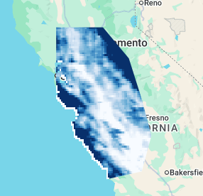

# Project 01 – CHIRPS Mean Precipitation (2020)

This project analyzes the mean annual precipitation for the year 2020 using the CHIRPS daily dataset in Google Earth Engine.  
The study area is a selected region inside Central Valley, California.

---

## 📌 Objective
Compute and visualize the mean precipitation for the year 2020 using the CHIRPS dataset and a custom polygon region.

---

## 🔧 Workflow
1. Define the study region using `ee.Geometry.Polygon`
2. Load the CHIRPS daily precipitation dataset
3. Filter the dataset by:
   - Date range: **2020-01-01 to 2020-12-31**
   - Study region
4. Compute the **mean annual precipitation**
5. Visualize the result on the map

---

## 📁 Project Structure

```
project01/
├── code.js
├── notes.md
├── README.md
└── outputs/
```


---

## ✅ Output Example



---

## 🧠 Notes & Observations
- CHIRPS is a reliable dataset for precipitation analysis in environmental and agricultural studies.
- Clipping the dataset to the study region improves clarity and reduces processing time.
- A simple color palette is enough for early-stage visualization.
- Future improvements:
  - Add a legend  
  - Export high-resolution images  
  - Compare multiple years  

---

## ✅ Tools Used
- **Google Earth Engine (JavaScript API)**
- **CHIRPS Daily Precipitation Dataset**

---

## 📅 Status
✅ **Month 01 – Project 01 Completed**
